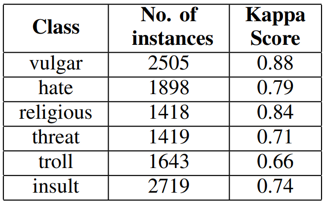
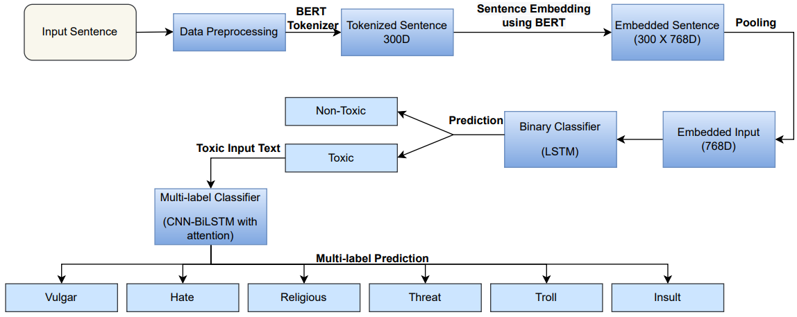
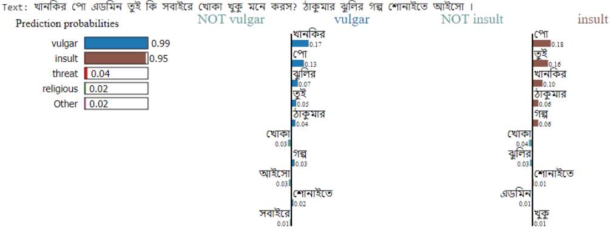

#  Interpretable Multi Labeled Bengali Toxic Comments Classification using Deep Learning
<p align="justify">
This paper presents a deep learning based pipeline for categorizing Bengali toxic comments, in which at 
first a binary classification model is used to determine whether a comment is toxic or not, and then a multi-label 
classifier is employed to determine which toxicity type the comment belongs to. For this purpose, 
we have prepared a manually labeled dataset consisting of 16,073 instances among which 8,488 are <em>Toxic</em> 
and any toxic comment may correspond to one or more of the six toxic categories – <em>vulgar, hate, religious, threat, troll,</em> 
and <em>insult</em> simultaneously. <em>Long Short Term Memory (LSTM) with BERT Embedding</em> achieved 89.42% accuracy 
for the binary classification task while as a multi-label classifier, a combination of <em>Convolutional Neural Network</em> 
and <em>Bi-directional Long Short Term Memory (CNN-BiLSTM) with attention mechanism</em> achieved 78.92% accuracy and 0.86 as weighted F1-score. 
To explain the predictions and interpret the word feature importance during classification by the 
proposed models, we utilized <em>Local Interpretable Model-Agnostic Explanations (LIME)</em> framework.
</p>

- The paper is published in [International Conference on Electrical, Computer and Communication Engineering (ECCE)](https://ieeexplore.ieee.org/xpl/conhome/10101485/proceeding) in 2023.

- **Paper Link**: https://ieeexplore.ieee.org/document/10101588

- **arXiv PDF**: https://arxiv.org/abs/2304.04087

## Repository Structure

The repository has two folders:

- **Codes**: All the codes for proposed models.

- **Dataset**: Contains two files (a) one csv and (b) one zip file.
	- The csv file contains all the 16,073 instances altogether. It has seven columns: <em>text, vulgar, hate, religious, threat, troll, Insult.</em>
	The <em>text</em> column contains the Bangla comments, and the rest six columns contain either 1 or 0. Here, 1 indicates the comment belongs to that toxic category.
	If all the six categories have 0, then the comment is considered <em>not toxic</em>.
	- The zip file contains the train, test, validation data split for the experimental results reported in the paper. 


## Dataset Statistics
<p align="justify">
The text samples were gathered from three sources: the
multi-labeled <em>"Bangla-Abusive-Comment-Dataset" (https://github.com/aimansnigdha/Bangla-Abusive-Comment-Dataset)</em> and the
multi-class <em>"Bengali Hate Speech Dataset" (https://github.com/rezacsedu/Bengali-Hate-Speech-Dataset)</em> and <em>"Bangla
Online Comments Dataset" (https://data.mendeley.com/datasets/9xjx8twk8p/1)</em>. Upon careful examination, it
was determined that the original labeling of the texts in these
datasets was not accurate or consistent. In some cases, the
texts were deemed to belong in multiple categories at once,
leading to the decision to manually categorize them into six
classes: vulgar, hate, religious, threat, troll, insult, where each
text could be assigned multiple labels. Reclassifying the texts
from multiple datasets into a new set of categories is crucial
for several reasons, including ensuring consistency, enhancing
data quality, providing more insightful information about the
nature and extent of toxicity, boosting the performance of
machine learning models, and streamlining data management.
The reclassification also offers a clearer understanding of the
toxicity present in the data and improves the accuracy of
machine learning models.
</p>

- Number of Total Data: 16073

	- Toxic - 8488 
	- Non-Toxic - 7585 

- Class wise data statistics


## Methodology


                                                             

## LIME Explanation




## Citation:
```Python
@INPROCEEDINGS{10101588,
  author={Belal, Tanveer Ahmed and Shahariar, G. M. and Kabir, Md. Hasanul},
  booktitle={2023 International Conference on Electrical, Computer and Communication Engineering (ECCE)}, 
  title={Interpretable Multi Labeled Bengali Toxic Comments Classification using Deep Learning}, 
  year={2023},
  volume={},
  number={},
  pages={1-6},
  doi={10.1109/ECCE57851.2023.10101588}}
```
